# tugas-4-python
Jawaban Tugas 4 Python
# Project Library Management System

## Membuat Database dan Tabel
Membuat Koneksi Ke Python'
```
Create_Databases_and_Tables.py
```
Membuat database "db_perpus" dan  yang berisi table yang dibutuhkan.
* tabel USER : list user yang melakukan pendafatarn
* tabel BUKU : list buku yang tersedia
* table PINJAM : list peminjam

Hasilnya:
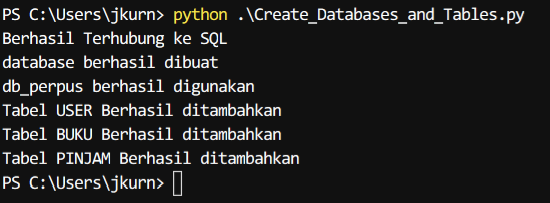

## Membuat Fungsi perantara
```
Def_Input.py
```
Fungsi penyambung untuk mengeksekusi perintah antara lain:
* def inputInt() : Untuk memastikan bahwa inputan adalah integer, kalau tidak makan akan mengulang sampai inputan sesuai.
* def inputStr() : Untuk memastikan bahwa inputan adalah string, kalau tidak makan akan mengulang sampai inputan sesuai.
* def upd_buku() : Melakukan update stock pada tabel BUKU apabila buku dipinjam/dikembalikan
* def hps_peminjam () : Melakukan update menghapus data pada tabel PINJAM apabila buku dikembalikan

## Main Menu
```
Main_Menu.py
```
Bersi menu yang akan dilakukan eksekusi terhadap fungsi lain seperti :
* Menu 1 : Mengeksekusi "Pendaftaran_User_Baru.py"
* Menu 2 : Mengeksekusi "Pendaftaran_Buku_Baru.py"
* Menu 3 : Mengeksekusi "Peminjaman_Buku.py"
* Menu 4 : Mengeksekusi "Tampilkan_Buku.py"
* Menu 5 : Mengeksekusi "Tampilkan_User.py"
* Menu 6 : Mengeksekusi "Tampilkan_Peminjam.py"
* Menu 7 : Mengeksekusi "Pencarian.py"
* Menu 8 : Mengeksekusi "Pengembalian.py"
* Menu 1 : Print "Terimakasih"
 

## Pendafataran User Baru
```
Pendaftaran_User_Baru.py
```
Proses terdiri dari:
* Membuat Koneksi Ke SQL
* Melakukan Inputan
* Menambahkan ke tabel USER

Hasilnya:
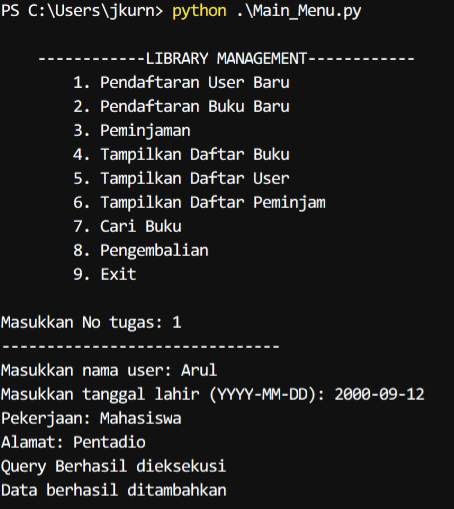

## Pendafataran Buku Baru
```
Pendaftaran_Buku_Baru.py
```
Membuat fungi add_user() dimana proses terdiri dari:
* Membuat Koneksi Ke SQL
* Melakukan Inputan
* Menambahkan ke tabel BUKU

Hasilnya:
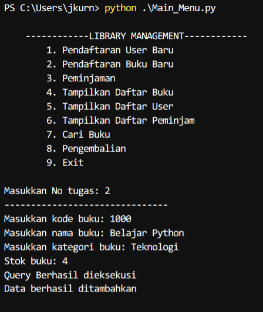

## Menampilkan Daftar Buku
```
Tampilkan_Buku.py
```
Membuat fungi show_buku() dimana proses terdiri dari:
* Membuat Koneksi Ke SQL
* Melakukan Inputan
* Mengambil data dari tabel BUKU sesuai inputan
Note : digunakan pandas untuk merapihkan tabel

Hasilnya:
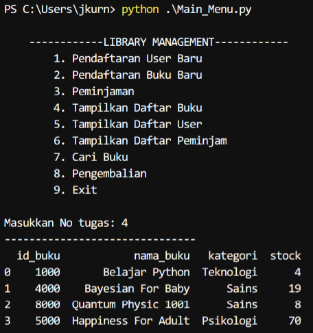

## Peminjaman Buku
```
Peminjaman_Buku.py
```
Membuat fungi add_buku() dimana proses terdiri dari:
* Membuat Koneksi Ke SQL
* Melakukan Inputan
* Menambahkan ke tabel PINJAM
* Mengurangi jumlah stock buku pada tabel BUKU

Hasilnya:
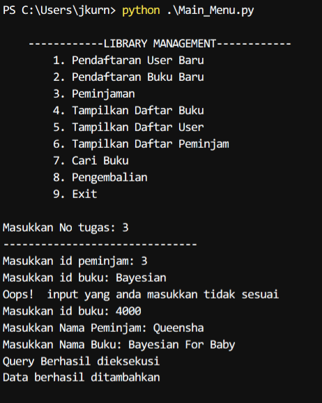

Update Stock Daftar buku: 
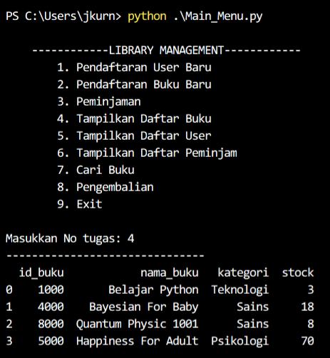

## Menampilkan Daftar User
```
Tampilkan_User.py
```
Membuat fungi show_user() dimana proses terdiri dari:
* Membuat Koneksi Ke SQL
* Melakukan Inputan
* Mengambil data dari tabel USER sesuai inputan
Note : digunakan pandas untuk merapihkan tabel

Hasilnya:
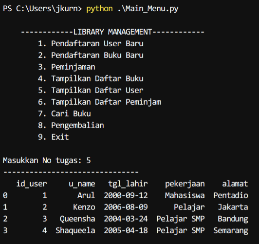

## Menampilkan Daftar Peminjam
```
Tampilkan_Peminjam.py
```
Membuat fungi show_pinjam() dimana proses terdiri dari:
* Membuat Koneksi Ke SQL
* Melakukan Inputan
* Mengambil data dari tabel PINJAM sesuai inputan
Note : digunakan pandas untuk merapihkan tabel

Hasilnya:
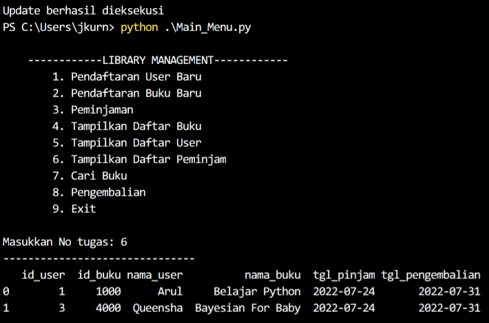

## Pencarian
```
Pencarian.py
```
Membuat fungi cari_buku() dimana proses terdiri dari:
* Membuat Koneksi Ke SQL
* Melakukan Inputan
* Mengambil data dari tabel BUKU sesuai inputan
Note : digunakan pandas untuk merapihkan tabel

Hasilnya:
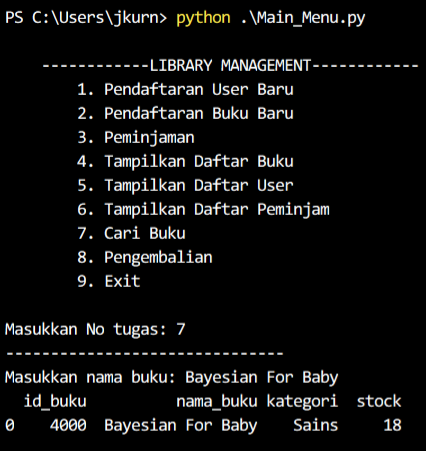

## Pengembalian
```
Pengembalian.py
```
Membuat fungi add_kembali() dimana proses terdiri dari:
* Membuat Koneksi Ke SQL
* Melakukan Inputan
* Melakukan update penambahan stock buku pada tabel BUKU
* Melakukan pengurangan peminjam pada tabel PINJAM

Hasilnya:
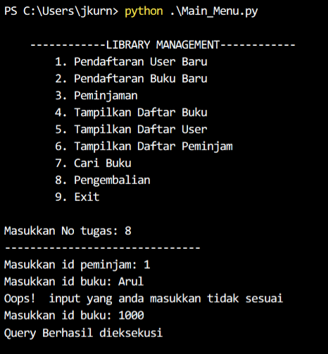

Update stock buku setelah dikembalikan:
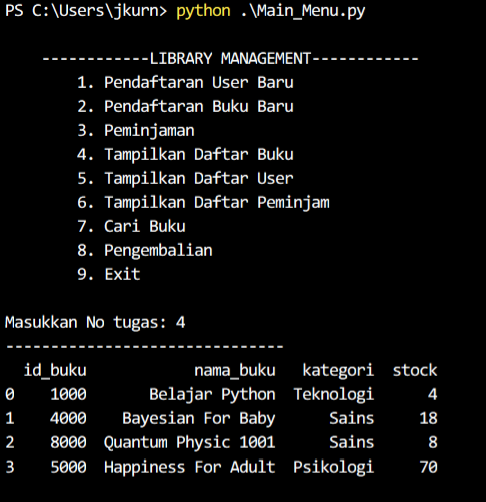

Update list peminjam setelah dikembalikan:
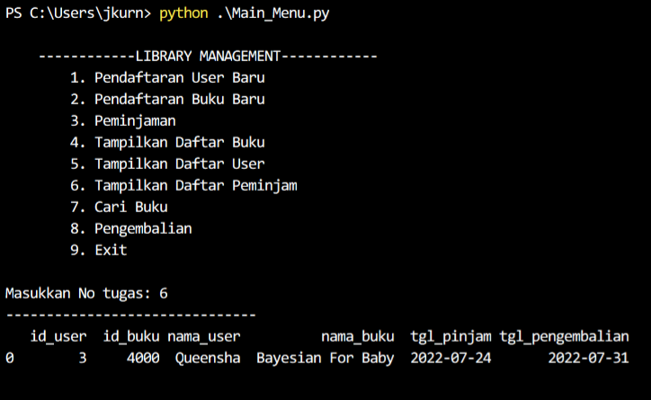

## Exit
Akan muncul pesan terimakasih
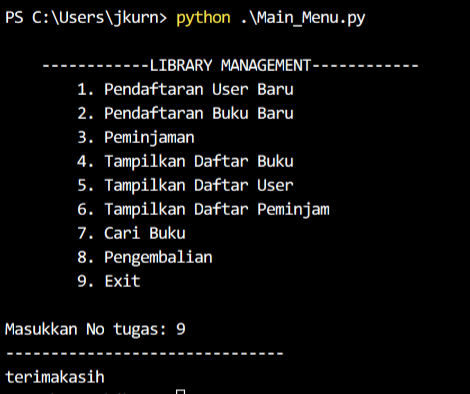


